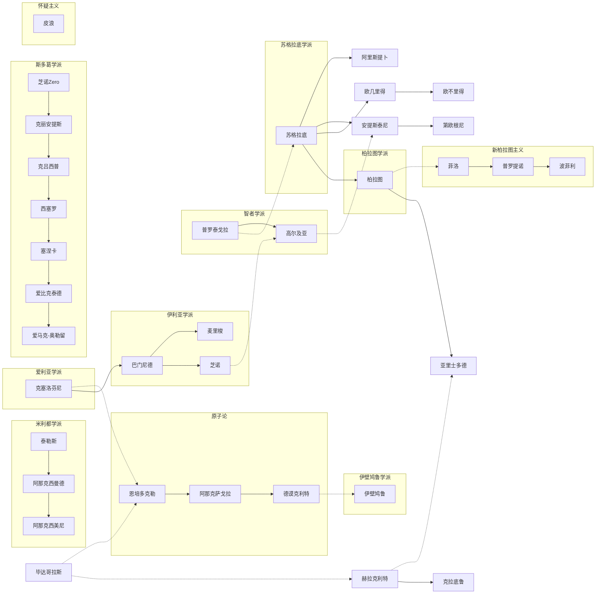

公元前6世纪至公元四世纪

```mermaid
graph LR
subgraph 米利都学派
泰勒斯 --> 阿那克西曼德 --> 阿那克西美尼
end
subgraph 爱利亚学派
克塞洛芬尼
end
subgraph 伊利亚学派
巴门尼德 --> 芝诺 & 麦里梭
end
克塞洛芬尼 --> 巴门尼德
毕达哥拉斯 -.-> 赫拉克利特 --> 克拉底鲁
subgraph 伊壁鸠鲁学派
伊壁鸠鲁
end
subgraph 原子论
恩培多克勒 --> 阿那克萨戈拉 --> 德谟克利特
end
克塞洛芬尼 & 毕达哥拉斯 -.-> 恩培多克勒
德谟克利特 -.-> 伊壁鸠鲁
普罗泰戈拉 -.-> 苏格拉底
欧几里得 --> 欧不里得
芝诺 -.-> 高尔及亚 -.-> 安提斯泰尼
subgraph 智者学派
普罗泰戈拉 --> 高尔及亚
end
subgraph 苏格拉底学派
苏格拉底
end
苏格拉底 --> 柏拉图 & 欧几里得 & 安提斯泰尼 & 阿里斯提卜
subgraph 柏拉图学派
柏拉图
end
安提斯泰尼 --> 第欧根尼
柏拉图 --> 亚里士多德
赫拉克利特 -.-> 亚里士多德
subgraph 斯多葛学派
芝诺Zero --> 克丽安提斯 --> 克吕西普 --> 西塞罗 --> 塞涅卡 --> 爱比克泰德 --> 爱马克-奥勒留
end
subgraph 新柏拉图主义
菲洛 --> 普罗提诺 --> 波菲利
end
柏拉图 -.-> 菲洛
subgraph 怀疑主义
皮浪
end
```
